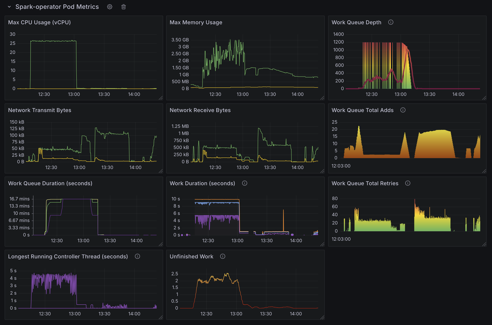
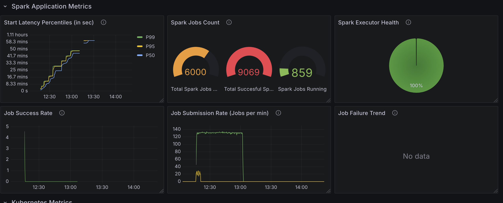
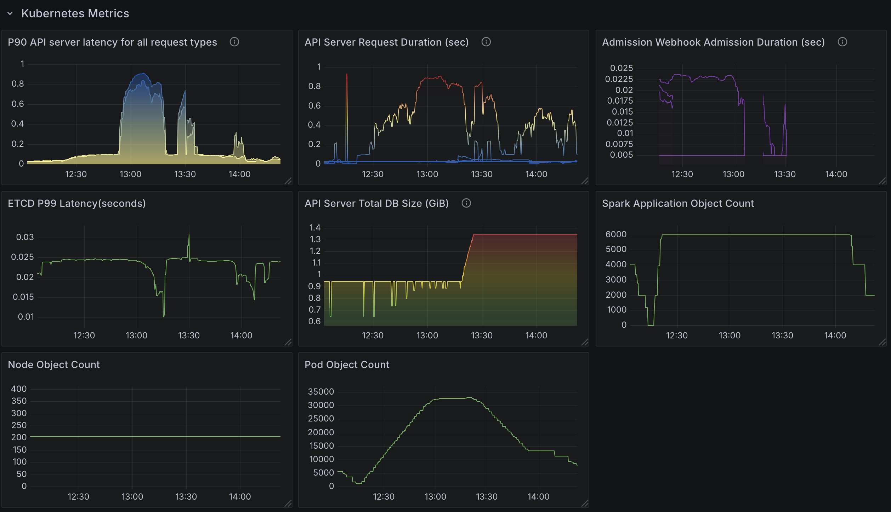
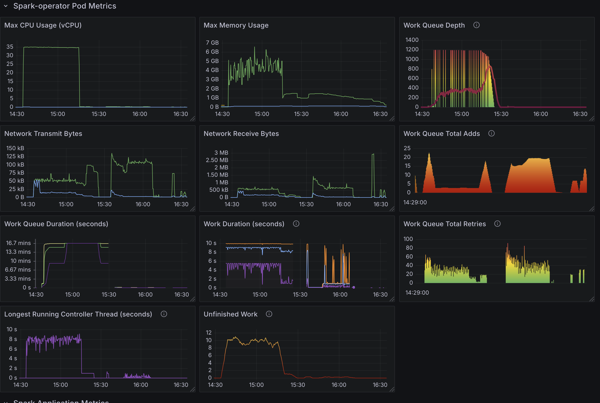
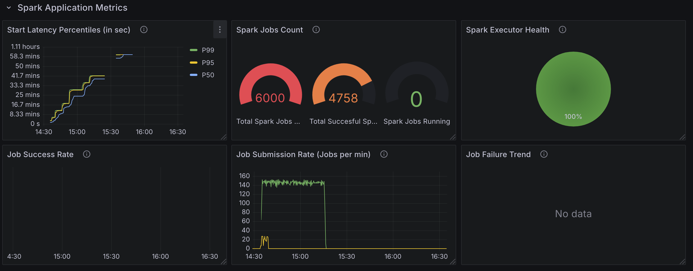
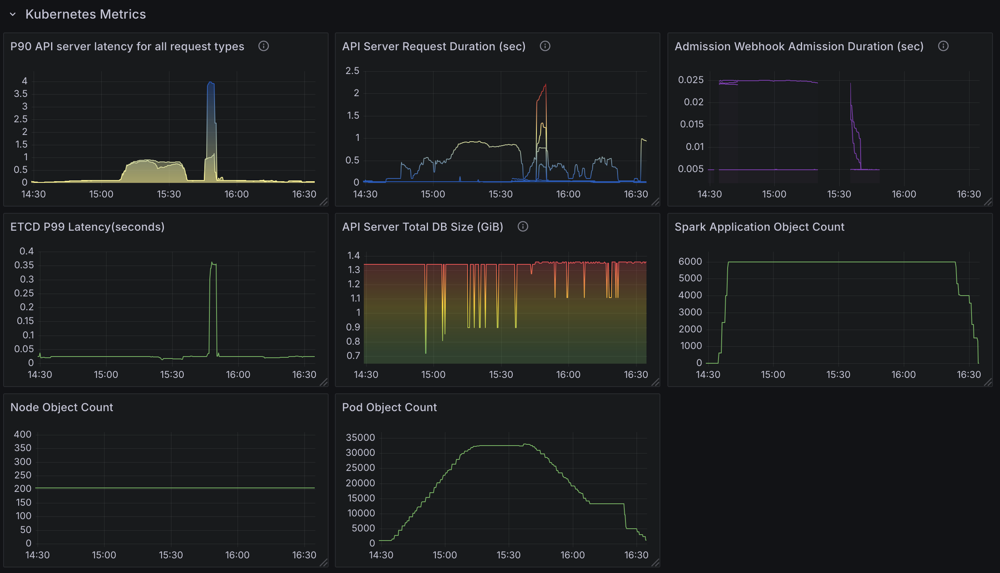
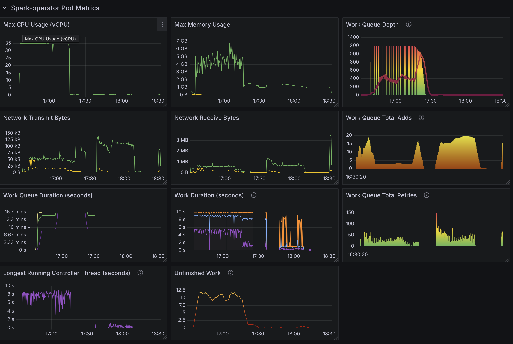
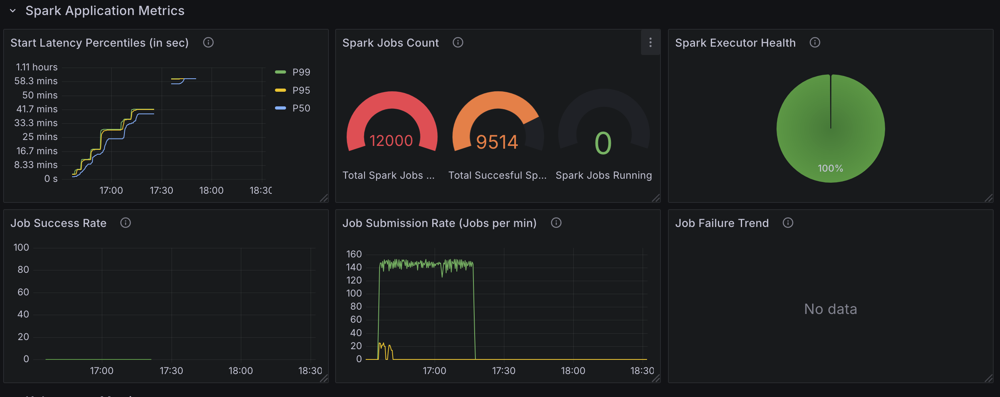
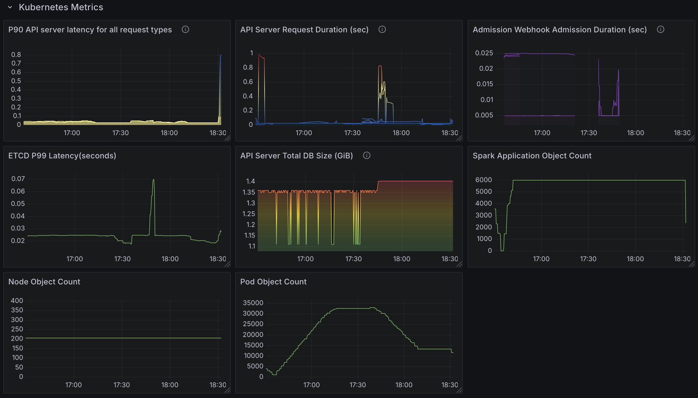

# Intro

As discussed in several issues in the past, 

# Observations

* Operator is CPU bound with minimum reliance on memory.
* Increase in Kubernetes API latency. This is not caused by the Operator. This is caused by Spark listing pods in its own namespace to find executor pods by issuing LIST calls.
* Significant delay in time it takes to update the status of Spark Application from Submitted to Running.
* Running a large number of SparkApplications in a namespace is not recommended because each application creates a service object. This leads to overloading of environment variables injected into pods. See [this](https://learn.microsoft.com/en-us/troubleshoot/azure/azure-kubernetes/create-upgrade-delete/application-fails-argument-list-too-long) for more information.
    * Service objects are not deleted on Spark Application completion. You must remove Spark Application objects to remove services.

# Questions

* Can we disable the UI service object?
* How do we measure the time it takes to update spark application status?
* Impact on API server from Spark.
    * Can you get away with `spark.kubernetes.executor.enablePollingWithResourceVersion` set to true in many cases?
    * Less polling ok to use? `spark.kubernetes.executor.apiPollingInterval`

# Test Setup

* Spark Operator pods exclusively on a c5.9xlarge instance.
    * 36 cores, 
    * 72 GB memory.

* Spark application pods are on 200 m6a.4xlarge nodes.
* 5 executor pods. Doing nothing but sleeping for the most part.
* Spark Applications are submitted through Locust as fast as possible.

## Default Configuration

Only configuration changed was `metrics-job-start-latency-buckets`. This is done to get relevant metrics because with the default setting, resolution above 5 minutes is lost. i.e. all percentile hit 300 seconds. Values changed to: `180,360,720,1080,1800,2160,2520,2880,3240,3600`

### 6000 apps

* 130 apps processed per minute.
* ~25 cores in use.
* Spread to three namespaces with 2000 applications in each namespace.
    * If all apps are deployed to a namespace, pods starts to fail due to `exec /opt/entrypoint.sh: argument list too long`.
* Significantly increased API latency.

##  Increased controller goroutine

* Increased available configured number of goroutine to 20 from 10 (default).

### 6000 apps

* 140 - 150 apps processed per minute.
* 35 cores in use.
* Otherwise results are similar to the default configuration results.

##  Increased controller goroutine with resource version set to 0.

* Increased available configured number of goroutine to 20 from 10 (default).
* Set `spark.kubernetes.executor.enablePollingWithResourceVersion: "true"` in SparkApplication config.

### 6000 apps

* Increase in API latency is virtually gone as expected.

