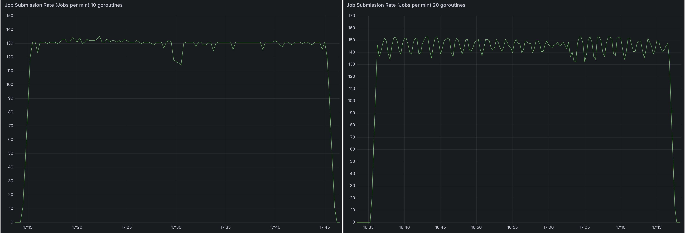
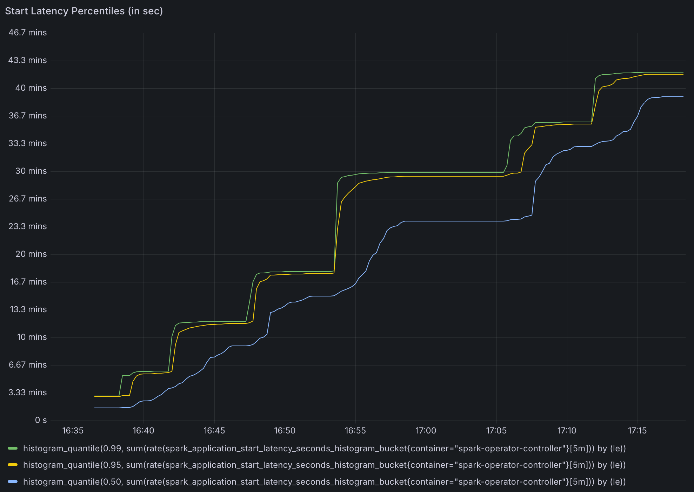
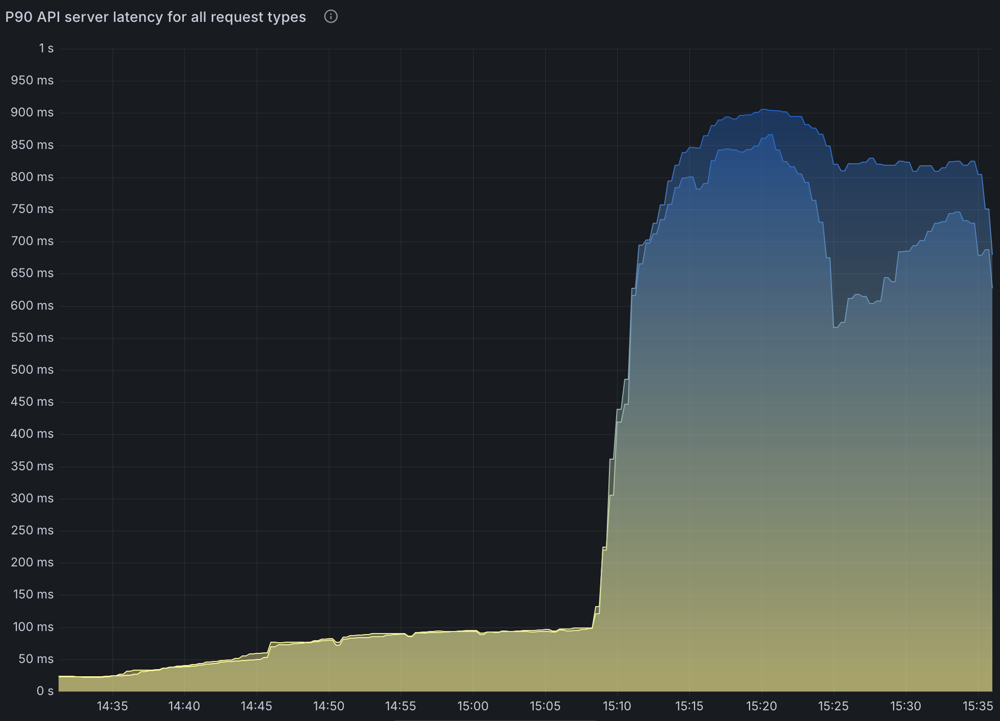
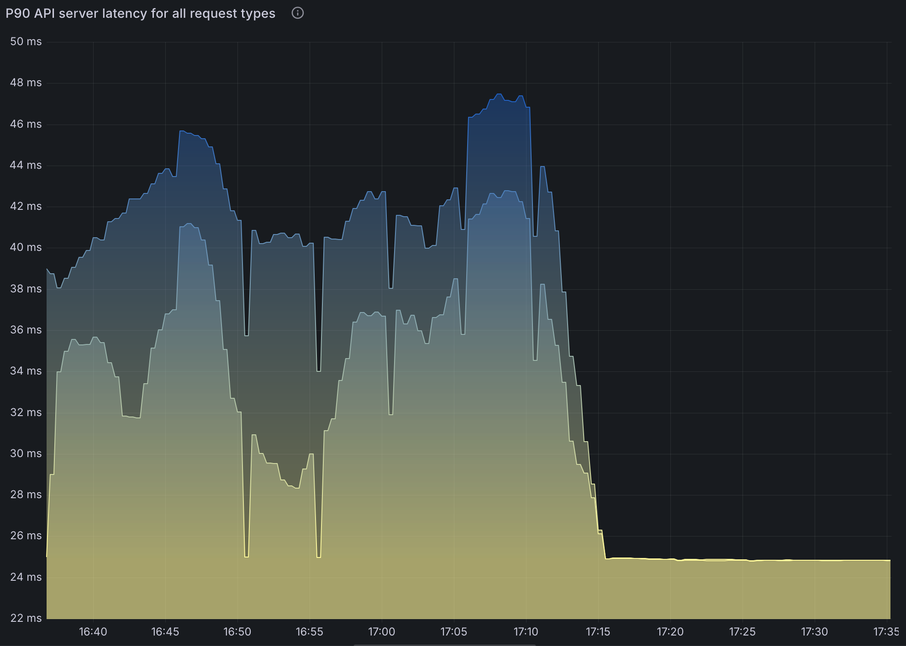

# Introduction

Apache Spark on Kubernetes has become increasingly popular as organizations adopt Kubernetes as their primary container orchestration platform. The Kubernetes Operator for Apache Spark provides native support for managing Spark applications on Kubernetes clusters. However, as organizations scale their Spark workloads, understanding the performance characteristics and limitations of the Spark Operator becomes crucial for reliable operations.

While there have been various discussions in the community about the Spark Operator's behavior under load, there hasn't been a comprehensive source for benchmark metrics that operators can reference. This lack of centralized performance data makes it challenging for teams to properly size and configure their Spark Operator deployments.

This document provides initial baseline performance metrics and analysis from load testing of the Spark Operator. The findings aim to help platform teams:

- Size Spark Operator resources appropriately
- Understand performance bottlenecks and limitations
- Make informed configuration decisions
- Plan for scale as their Spark workloads grow


# Test Setup

* AWS EKS v1.31 (Platform version eks.18)
* Spark Operator 2.1.0
* Spark Operator pods exclusively placed on a c5.9xlarge EC2 instance.
    * 36 cores, 
    * 72 GB memory.
* Spark application pods (drivers and executors) are placed on 200 m6a.4xlarge nodes. No limits.
* Spark 2.5.3
* 5 executor pods sleeps for 60 minutes.
* 6000 Spark Applications submitted through Locust as fast as possible. 
* 6000 Spark Applications were spread across three namespaces.

## Operator Configuration

The operator was deployed with default helm configuration except for `metrics-job-start-latency-buckets` because the default maximum bucket size of 500 was too small to meaningfully measure job start time.

# Observations


## Spark Operator throughput is CPU bound with minimum reliance on memory.

Spark Operator's throughput indicated by the `spark_application_submit_count` metric, is soley influenced by CPU single core speed, available number of cores, and configured number goroutines.

On a machine with 36 cores, going from 10 goroutines to 20 saw a slight increase in processing speed.



The number of applications submitted to the cluster does not affect the processing speed. There was no difference between 2000 apps and 6000 apps.

Memory footprint does not change between the number of apps submitted. However, with it does increase with the number of goroutine.

## Significant delay in Spark start time.

Because the operator can only process 130 - 150 applications per minute, later Spark jobs took ~1 hour for their driver pods to spawn.



## Significant delay in SparkApplication CR status update.

Because Spark operator was busy processing new applications, updates to status of submitted spark application were slow. Some applications took ~30 minutes for their status to be updated. (TODO: need to measure this.)


## Running a large number of SparkApplications in a namespace is not recommended.

With 6000 applications in a namespace, pods started to fail with:

```
exec /opt/entrypoint.sh: argument list too long
```

This is because the operator creates service object for each application. Once enough services are created, they cannot fit in environment variables that record the host and port for each active service.

In addition, service objects are not deleted on Spark Application completion. You must remove Spark Application objects to remove services. This means setting a sane TTL value or a custom GC service is required.

## Increase in Kubernetes API latency. 

Consistent significant delay in LIST calls. This is not caused by the Operator, it's caused by Spark listing pods in its own namespace to find executor pods.




Note that setting `spark.kubernetes.executor.enablePollingWithResourceVersion: "true"` in SparkApplication config greatly alleviates this issue. 



However, this means the API server could return any version of pods especially in HA configurations. 
This could lead to an inconsistent state that Spark cannot recover from.


# Questions

* Can we disable the UI service object?
* How do we measure the time it takes to update spark application status?
* Impact on API server from Spark.
    * Can you get away with `spark.kubernetes.executor.enablePollingWithResourceVersion` set to true in many cases?
    * Increase polling interval? `spark.kubernetes.executor.apiPollingInterval`


# Details

### 6000 apps

* 130 apps processed per minute.
* ~25 cores in use.
* Spread to three namespaces with 2000 applications in each namespace.
    * If all apps are deployed to a namespace, pods starts to fail due to `exec /opt/entrypoint.sh: argument list too long`.
* Significantly increased API latency.


##  Increased controller goroutine

* Increased available configured number of goroutine to 20 from 10 (default).

### 6000 apps

* 140 - 150 apps processed per minute.
* 35 cores in use.
* Otherwise results are similar to the default configuration results.


##  Increased controller goroutine with resource version set to 0.

* Increased available configured number of goroutine to 20 from 10 (default).
* Set `spark.kubernetes.executor.enablePollingWithResourceVersion: "true"` in SparkApplication config.

### 6000 apps

* Increase in API latency is virtually gone as expected.


