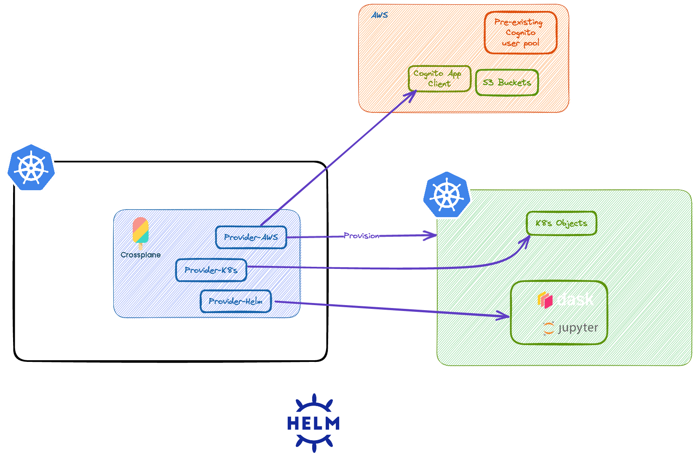

import Tabs from '@theme/Tabs';
import TabItem from '@theme/TabItem';
import CollapsibleContent from '../../src/components/CollapsibleContent';

# JupiterHub wth Dask

## Introduction

Jupyter is one of the most popular and important open-source software used for data analysis worldwide. Jupyter notebooks allow for data scientists and researchers to leverage an easy to use and flexible user interface to conduct analysis in R, Python, and Julia. Jupyter can also be leveraged to set up a shared environment known as a Jupyterhub where multiple researchers can share notebooks for different analyses, collaborate to solve problems and share data easily with one another. 
This example leverages Crossplane to create a EKS cluster with DaskHub installed from a single YAML file.

<CollapsibleContent header={<h2><span>JupyterHub wth Dask, Cluster Auto Scaler, and Crossplane</span></h2>}>

This option creates a hub EKS cluster with Crossplane and its providers installed. This is the management cluster that is responsible for creating AWS and Kubernetes resources.
Using the management cluster, we will create another EKS cluster with JupyterHub, [Dask](https://www.dask.org/), and Cluster Auto Scaler installed.



1. Create your management EKS cluster by following steps available in[ this document](https://github.com/awslabs/crossplane-on-eks/tree/main/bootstrap/terraform#how-to-deploy).

2. Once your management cluster is ready, ensure your Crossplane providers are installed and healthy. 
    ```bash
    $ kubectl get Providers
    NAME                  INSTALLED   HEALTHY   PACKAGE                                                         AGE
    provider-aws          True        True      xpkg.upbound.io/crossplane-contrib/provider-aws:v0.39.0         89d
    provider-helm         True        True      xpkg.upbound.io/crossplane-contrib/provider-helm:v0.14.0        6d
    provider-kubernetes   True        True      xpkg.upbound.io/crossplane-contrib/provider-kubernetes:v0.7.0   6d
    ```

3. From the Crossplane on EKS repository, apply the necessary compositions. 
    ```bash
    $ kubectl apply -f compositions/aws-provider/vpc-subnets/
    $ kubectl apply -f compositions/aws-provider/eks/
    $ kubectl apply -f compositions/aws-provider/daskhub/
    
    # verify installation was successful
    $ kubectl get xrd
    NAME                                   ESTABLISHED   OFFERED   AGE
    xamazonekss.cluster.awsblueprints.io   True          True      5d23h
    xdaskhubs.awsblueprints.io             True          True      5d23h
    xvpcsubnets.network.awsblueprints.io   True          True      5d23h    
    ```

4. You create your second EKS cluster through a single YAML file with Crossplane. Applying this file will create a cluster with cluster auto scaler installed and allows specified IAM role (defaults to Admin) to manage the cluster. You may need to [update the file](https://github.com/awslabs/crossplane-on-eks/blob/main/examples/aws-provider/composite-resources/eks/eks-cas-claim.yaml) with your own configuration.

    ```bash
    $ kubectl apply -f examples/aws-provider/composite-resources/eks/eks-cas-claim.yaml
    ```
    This process typically takes 20-30 minutes. You can track the creation of this cluster with `kubectl describe xamazoneks`. If you would like to get more detailed information, you use the kubectl tree plugin or the kubectl lineage plugin. 

    ```bash
    # Get the name of the cluster
    $ kubectl get xamazoneks
    NAME                       CLUSTER-NAME         SYNCED   READY   COMPOSITION                                AGE
    example-cas-jvnsr   example-cas   True     False   xamazonekss-cas.cluster.awsblueprints.io   3m4s

    $ kubectl tree -A xamazoneks example-cas-jvnsr
    NAMESPACE          NAME                                                              READY  REASON       AGE
                    XAmazonEks/example-cas-jvnsr                                       False  Creating     30m
                    ├─Addon/eks-worker-csi-example-cas                                 False  Unavailable  10m
                    │ └─ProviderConfigUsage/d9449065-fac9-40ae-863d-d5914f895df9      -                   10m
                    ├─Cluster/example-cas                                              True   Available    30m
                    │ ├─ProviderConfigUsage/4b032694-dbbc-402a-aa98-4e2c8a7fc9fb      -                   20m
    crossplane-system  │ └─Secret/02ba3ffa-c50e-4995-ac44-1e9fe882b080-eks-cluster-conn  -                   20m
                    ├─NodeGroup/example-cas-jvnsr-4xtgw                                True   Available    30m
                    │ └─ProviderConfigUsage/5366e98d-4dbf-4d44-8c40-49e05349511c      -                   20m
                    ├─Object/cas-cluster-role-binding-example-cas                      True   Available    30m
                    │ └─ProviderConfigUsage/da087f41-61c3-4622-ac78-e717bea6e2d5      -                   30m
                    ├─Object/cas-cluster-role-example-cas                              True   Available    30m
                    │ └─ProviderConfigUsage/d4746027-6d30-4477-a39c-c12427aa399e      -                   30m

    ```


</CollapsibleContent>

